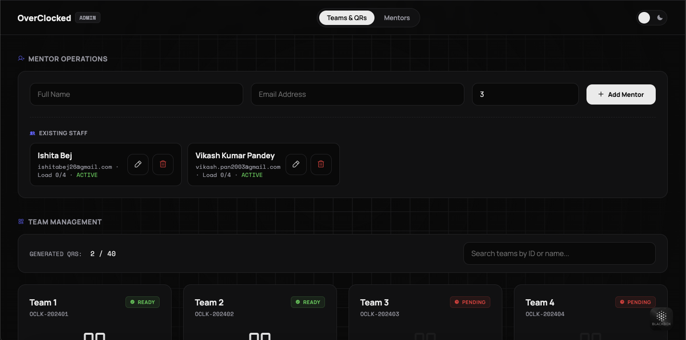
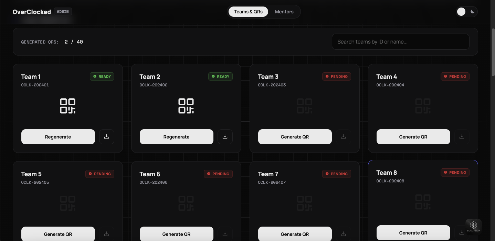
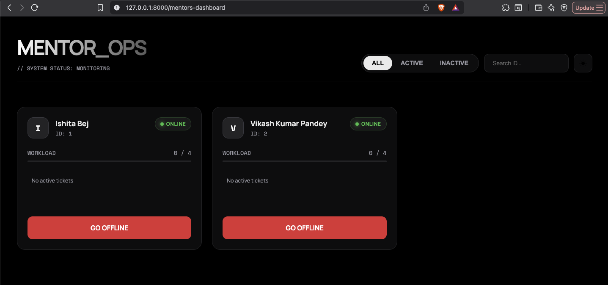
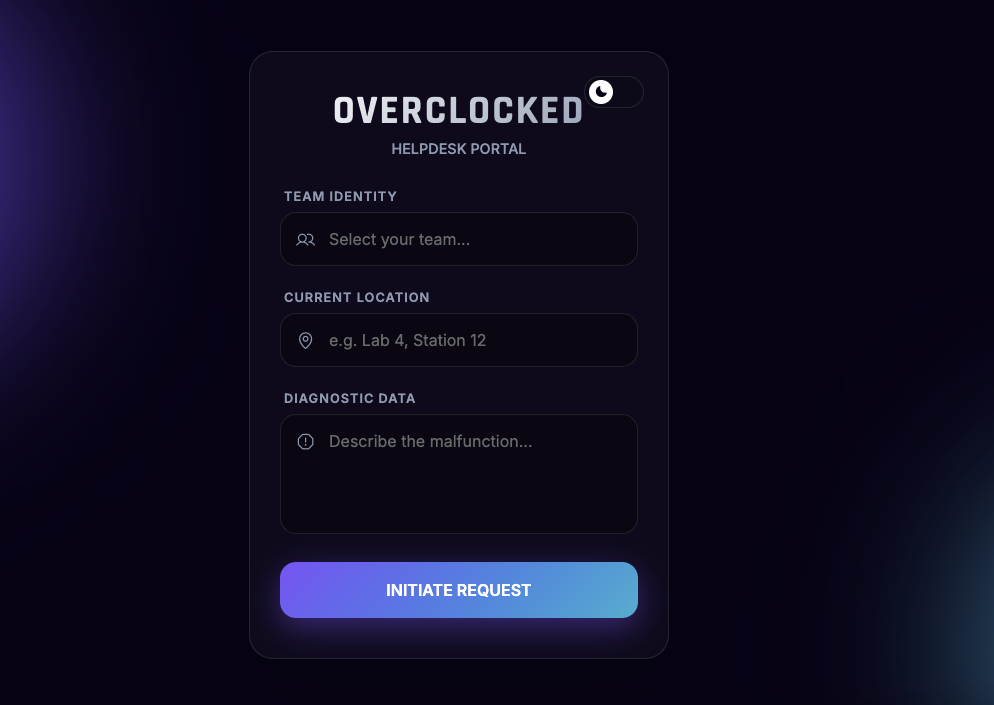

# OverClocked Helpdesk - CPFANI

O OverClocked Helpdesk é um sistema de suporte técnico baseado em FastAPI, desenvolvido para hackathons e eventos universitários. Permite que equipes registrem chamados, administradores gerenciem mentores e mentores visualizem e respondam aos chamados atribuídos em tempo real. O sistema foca em roteamento rápido, visibilidade clara e coordenação manual mínima durante eventos.

O projeto foi projetado para funcionar como uma plataforma central de atendimento, onde as equipes não precisam procurar mentores, e os mentores podem ver exatamente o que precisam atender.

---

## Stack Tecnológica

* Python 3.11+
* FastAPI
* SQLAlchemy
* SQLite (desenvolvimento local - sem configuração extra)
* Jinja2 Templates
* HTML, CSS, JavaScript
* Uvicorn

---

## Funcionalidades

* Formulário de helpdesk para equipes registrarem chamados
* Painel administrativo para gerenciar mentores e visualizar chamados
* Painel de mentores para ver chamados atribuídos
* Lógica automática de atribuição de mentores
* Acesso baseado em QR Code para equipes
* Suporte a notificações por e-mail
* Suporte a notificações via Slack
* Separação clara entre visões de administrador, mentor e equipe
* Interface 100% em português do Brasil (pt-BR)
* Timezone configurado para America/Sao_Paulo
* Script de instalação automatizado para Windows

---

## Estrutura do Projeto

    OverClocked-CPFANI/
    │
    ├── overclocked_helpdesk/
    │   ├── api/
    │   │   ├── admin.py          # Rotas e lógica administrativa
    │   │   ├── mentors.py        # APIs relacionadas a mentores
    │   │   ├── queries.py        # APIs de chamados das equipes
    │   │   ├── qr.py             # Lógica de geração de QR Code
    │   │   └── __init__.py
    │   │
    │   ├── db/
    │   │   ├── schema.py         # Configuração dos modelos do banco
    │   │   └── session.py        # Gerenciamento de sessão do banco
    │   │
    │   ├── models/
    │   │   ├── mentor.py         # Modelo da tabela de mentores
    │   │   ├── query.py          # Modelo da tabela de chamados
    │   │   └── team.py           # Modelo da tabela de equipes
    │   │
    │   ├── services/
    │   │   ├── assigner.py       # Lógica de atribuição de mentores
    │   │   ├── email_service.py  # Lógica de notificação por e-mail
    │   │   ├── slack_service.py  # Lógica de notificação via Slack
    │   │   └── notifier.py       # Handler unificado de notificações
    │   │
    │   ├── utils/
    │   │   └── qr.py             # Utilitários de QR Code
    │   │
    │   ├── config.py             # Configurações e settings da aplicação
    │   ├── main.py               # Ponto de entrada da aplicação FastAPI
    │   └── __init__.py
    │
    ├── templates/
    │   ├── admin_dashboard.html  # Interface do administrador
    │   ├── mentor_dashboard.html # Interface do mentor
    │   ├── helpdesk_form.html    # Formulário de chamados das equipes
    │   ├── team_status.html      # Página de status do chamado
    │   └── success.html          # Página de sucesso de envio
    │
    ├── scripts/
    │   ├── seed_data.py          # População inicial de dados
    │   ├── test_email.py         # Script de teste de e-mail
    │   └── test_notifier.py      # Teste de notificações
    │
    ├── logs/                     # Diretório de logs (gerado automaticamente)
    ├── static/                   # Arquivos estáticos (CSS, JS, QR Codes)
    ├── requirements.txt          # Dependências Python
    ├── instalar.bat              # Script de instalação automatizada (Windows)
    ├── .gitignore                # Configuração do Git
    └── README.md                 # Documentação do projeto

---

## Screenshots

### Painel Administrativo

### Geração de QR Code

### Painel de Mentores

### Formulário de Helpdesk

---

## Como Executar Localmente

### Método 1: Instalação Automatizada (Recomendado para Windows)

1. **Clone o repositório**

        git clone https://github.com/sunstrix/OverClocked-CPFANI.git
        cd OverClocked-CPFANI

2. **Execute o script de instalação**

        instalar.bat

O script irá automaticamente:
- Verificar e instalar Git (se necessário)
- Verificar e instalar Python 3.11+ (se necessário)
- Instalar C++ Build Tools (se Python > 3.12)
- Atualizar pip, setuptools e wheel
- Instalar todas as dependências do projeto
- Gerar logs detalhados em `logs/instalacao.log`

3. **Inicie o servidor FastAPI**

        uvicorn overclocked_helpdesk.main:app --reload

### Método 2: Instalação Manual

1. **Clone o repositório**

        git clone https://github.com/sunstrix/OverClocked-CPFANI.git
        cd OverClocked-CPFANI

2. **Crie e ative o ambiente virtual**

**Windows:**

        python -m venv venv
        venv\Scripts\activate

**Linux/Mac:**

        python -m venv venv
        source venv/bin/activate

3. **Instale as dependências**

        pip install -r requirements.txt

4. **Execute o servidor FastAPI**

        uvicorn overclocked_helpdesk.main:app --reload

5. **Acesse no navegador**

* Aplicação: [http://127.0.0.1:8000](http://127.0.0.1:8000)
* Documentação da API: [http://127.0.0.1:8000/docs](http://127.0.0.1:8000/docs)
* ReDoc: [http://127.0.0.1:8000/redoc](http://127.0.0.1:8000/redoc)

---

## Configuração do Banco de Dados

O projeto utiliza **SQLite** por padrão, sem necessidade de configuração adicional. O banco de dados é criado automaticamente na raiz do projeto como `helpdesk.db` na primeira execução.

Para configurar variáveis de ambiente opcionais (SMTP, Slack, etc.), crie um arquivo `.env` na raiz do projeto:

    # Configurações de E-mail (opcional)
    SMTP_SERVER=smtp.gmail.com
    SMTP_PORT=465
    SMTP_USER=seu_email@gmail.com
    SMTP_PASSWORD=sua_senha_de_app

    # Configurações do Slack (opcional)
    SLACK_BOT_TOKEN=xoxb-seu-token
    SLACK_WEBHOOK_URL=https://hooks.slack.com/services/...

    # Configurações de Segurança
    SECRET_KEY=sua_chave_secreta_aqui

---

## Casos de Uso

Este projeto é ideal para:

* Hackathons
* Eventos técnicos universitários
* Festivais de tecnologia internos
* Qualquer evento onde equipes precisam de acesso rápido a mentores
* Suporte técnico em competições de programação
* Monitoria em laboratórios de informática

---

## Estrutura de Rotas da API

### Rotas Públicas
- `GET /` - Formulário de abertura de chamado
- `POST /submit` - Submete novo chamado
- `GET /team-status?team={id}` - Página de status do chamado
- `GET /team/{team_id}/status` - API de status do chamado

### Rotas de Mentores
- `GET /mentors-dashboard` - Painel de mentores
- `GET /mentors/state` - Estado atual dos mentores
- `PATCH /mentors/{id}/toggle-availability` - Alterna disponibilidade

### Rotas Administrativas
- `GET /admin` - Painel administrativo
- `POST /admin/teams/{id}/generate-qr` - Gera QR Code
- `POST /admin/mentors` - Adiciona mentor
- `PATCH /admin/mentors/{id}` - Atualiza mentor
- `DELETE /admin/mentors/{id}` - Remove mentor

### Rotas de Chamados
- `GET /queries/pending` - Chamados pendentes
- `GET /queries/mentor/{id}` - Chamados do mentor
- `PATCH /queries/{id}/accept/{mentor_id}` - Mentor aceita chamado
- `PATCH /queries/{id}/resolve` - Resolve chamado

---

## Escopo Futuro

* Autenticação para administradores e mentores
* Atualizações em tempo real usando WebSockets
* Suporte a deploy usando Docker
* Painel de analytics para administradores
* Exportação de relatórios em PDF/Excel
* Integração com sistemas de tickets externos
* Suporte a múltiplos idiomas
* Aplicativo mobile para mentores

---

## Contribuindo

Contribuições são bem-vindas! Para contribuir:

1. Faça um fork do projeto
2. Crie uma branch para sua feature (`git checkout -b feature/NovaFeature`)
3. Commit suas mudanças (`git commit -m 'Adiciona NovaFeature'`)
4. Push para a branch (`git push origin feature/NovaFeature`)
5. Abra um Pull Request

---

## Licença

Este projeto é de código aberto e está disponível sob a licença MIT.

---

## Contato

Para dúvidas, sugestões ou suporte, abra uma issue no repositório do GitHub.

**Desenvolvido com ❤️ para a comunidade técnica brasileira.**